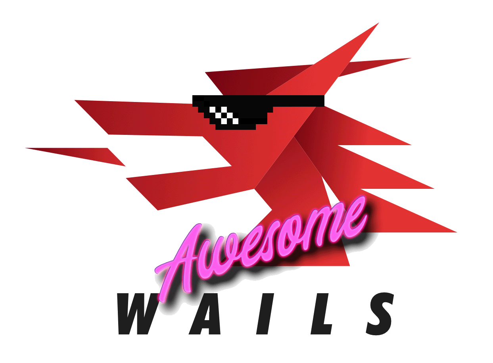

# Awesome Wails

<picture>
  <source
    srcset="./assets/images/logo-dark.png"
    media="(prefers-color-scheme: dark)"
  />
  <source
    srcset="./assets/images/logo-light.png"
    media="(prefers-color-scheme: light), (prefers-color-scheme: no-preference)"
  />
  
</picture>

Wails のエコシステムとコミュニティから厳選された最高のもののコレクション。

  
  
    

<strong>
<samp>

[English](README.md) · [简体中文](README.zh-Hans.md) · [日本語](README.ja.md) · [Русский](README.ru.md)

</samp>
</strong>

## 目次

- [目次](#目次)
- [テンプレート](#テンプレート)
- [スターター](#スターター)
- [アプリ](#アプリ)
  - [オープンソース](#オープンソース)
  - [クローズド ソース](#クローズド-ソース)
- [チュートリアル](#チュートリアル)
- [記事](#記事)

## テンプレート

- [wails-template-vue](https://github.com/misitebao/wails-template-vue) - Vue と Vue-Router をベースにした wails テンプレート
- [wails-template-primevue-sakai](https://github.com/TekWizely/wails-template-primevue-sakai) - 無料のPrimeVue Sakaiアプリケーションテンプレート（Vite、Vue、PrimeVue、TailwindCSS、Vue Router、テーマ、ダークモード、UIコンポーネントなど）に基づいたWailsテンプレート

## Starter

## スターター

- [My App](https://github.com/jinyaoMa/my-app/tree/starter-code) - Wails v2 + Systray + Gin + Vue3 が含まれ、フロントエンド部分にmonorepoを使用した構造

## アプリ

### オープンソース

- [Transok](https://github.com/bent2685/transok-wails) - wails + reactで実現されたローカルエリアネットワークファイル転送ツール
- [Cantor](https://github.com/evercyan/cantor) - wails + vue + github-api をベースにした個人用画像ベッドアプリ
- [DevToolKit](https://github.com/qaware/dev-tool-kit) - ソフトウェア開発者のための多くの便利なツールを備えたデスクトップアプリケーション
- [Justnotes](https://github.com/justmiles/justnotes) - typora に似たマークダウンエディター
- [Optimus](https://github.com/Splode/optimus) - 画像の圧縮・最適化・変換を行うデスクトップアプリ
- [Triangula GUI](https://github.com/RH12503/triangula-gui) - ポリゴン化した画像を生成するために Triangula を使用し、フロントエンドに Wails を使用した軽量なアプリ
- [MT-SATA-server](https://github.com/newproplus/MT-SATA-server) - メタトレーダー向けの半自動取引アシスタント サーバー
- [CFN Tracker](https://github.com/GreenSoap/cfn-tracker) - ストV CFN トラッカー
- [RWKV-Runner](https://github.com/josStorer/RWKV-Runner) - RWKV大規模言語モデルの管理、起動、およびインタラクティブツール、OpenAI互換のAPIを備えています
- [Callie](https://github.com/MikeyA-yo/callie) - グループ通話や会議通話を行うためのデスクトップアプリケーション
- [goer](https://github.com/Illusionna/LocalTransfer) - クロスプラットフォームのHTTPファイルサーバーです
- [Maxx-gui](https://github.com/dusbot/maxx-gui) — Wailsで構築されたオールインワンネットワークスキャンツール。
- [Voidraft](https://github.com/landaiqing/voidraft.git) - 開発者向けの優雅なテキストスニペット記録ツール
- [Peirato's Piano](https://github.com/Peiratooo/Peirato-s-Piano) - 軽量なデスクトップ用ピアノキーボード。MIDIデバイスの接続に対応しています。

### クローズド ソース

- [小白兔 AI](https://xiaobaituai.com/download) - コンテンツクリエイターを支援する生産性向上 AI ツールキット
- [Tuna Desktop](https://tuna.am/en/blog/tuna-desktop-first/) - インターネットからローカルホストにアクセスするための HTTP/TCP トンネルを作成するアプリケーションです

## チュートリアル

## 記事
