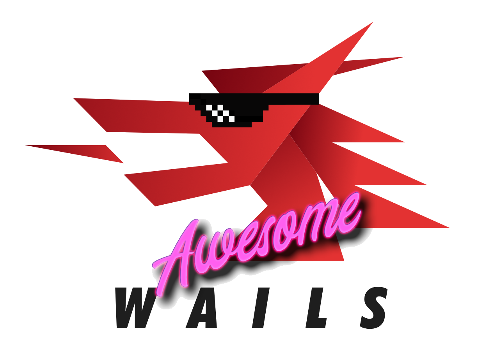

# Awesome Wails

    

Wails のエコシステムとコミュニティから厳選された最高のもののコレクション。

  
  
    

<strong>
<samp>

[English](README.md) · [简体中文](README.zh-Hans.md) · [日本語](README.ja.md)

</samp>
</strong>

## 目次

- [目次](#目次)
- [テンプレート](#テンプレート)
- [アプリ](#アプリ)
  - [オープンソース](#オープンソース)
  - [クローズド ソース](#クローズド-ソース)

## テンプレート

- [wails-template-vue](https://github.com/misitebao/wails-template-vue) - Vue と Vue-Router をベースにした wails テンプレート

## アプリ

### オープンソース

- [Cantor](https://github.com/evercyan/cantor) - wails + vue + github-api をベースにした個人用画像ベッドアプリ
- [DevToolKit](https://github.com/qaware/dev-tool-kit) - ソフトウェア開発者のための多くの便利なツールを備えたデスクトップアプリケーション
- [Justnotes](https://github.com/justmiles/justnotes) - typora に似たマークダウンエディター
- [Optimus](https://github.com/Splode/optimus) - 画像の圧縮・最適化・変換を行うデスクトップアプリ
- [Triangula GUI](https://github.com/RH12503/triangula-gui) - ポリゴン化した画像を生成するために Triangula を使用し、フロントエンドに Wails を使用した軽量なアプリ

<!-- ### クローズド ソース -->
